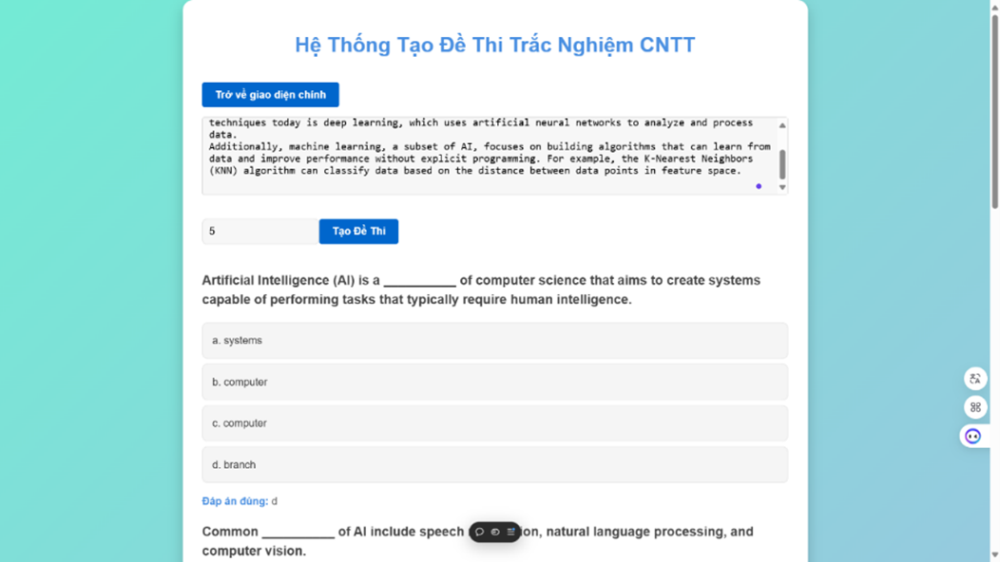
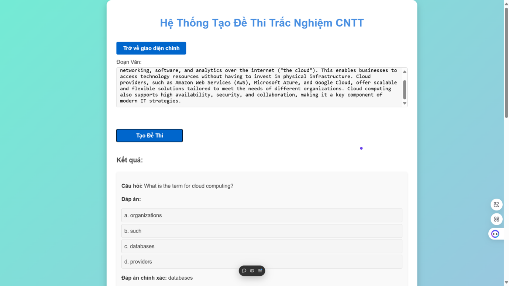
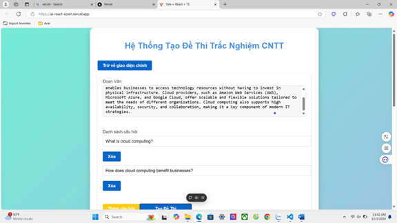

# Hệ thống tạo đề thi trắc nghiệm (FRONT-END)
<table align="center">
  <tr>
    <td align="center"><br>en_core_web_sm</td>
    <td align="center"><br>T5</td>
    <td align="center"><br>BERT</td>
  </tr>
</table>

## Giới thiệu
**Hệ thống tạo đề thi trắc nghiệm** là hệ thống tạo đề thi trắc nghiệm điền từ và trắc nghiệm a,b,c,d từ đoạn văn đưa vào bằng mô hình en_core_web_sm, t5 và BERT.

## Tính năng chính 
- **Mô hình en_core_web_sm**: Tạo đề thi trắc nghiệm dạng điền từ
- **Mô hình T5**: Tạo đề thi trắc nghiệm a,b,c,d
- **Mô hình BERT**: Tạo đáp án a,b,c,d từ đoạn văn và câu hỏi

## Công nghệ sử dụng
- **Flask**: Back-End
- **Vercel**: Triển khai và chạy hệ thống trên môi trường production.

## Yêu cầu hệ thống
- **Node.js** phiên bản **20.17.0** (Cần cài đặt trước khi chạy dự án)

## Cài đặt và chạy dự án
### 1. Cài đặt dependencies
Chạy lệnh sau để cài đặt các thư viện cần thiết:
```bash
npm install
```

### 2. Khởi động server phát triển
Chạy lệnh sau để khởi động dự án:
```bash
npm run dev
```

Hệ thống sẽ chạy trên **localhost**, bạn có thể truy cập bằng trình duyệt để kiểm tra giao diện và tính năng.

## Liên kết hệ thống
- **Back-End (GitHub)**: https://github.com/LongMyNgoc/Multiple-choice-question-generation-system-BE.git
- **Front-End (GitHub)**: https://github.com/LongMyNgoc/Multiple-choice-question-generation-system-FE.git
- **Front-End (Vercel)**: https://ai-react-eosin.vercel.app/

## Video chạy chương trình
- **Youtube**: https://youtu.be/wHyNzmeHIu8

## Đóng góp & Phát triển
Mọi ý kiến đóng góp hoặc báo lỗi có thể được gửi qua hệ thống quản lý mã nguồn của dự án hoặc liên hệ với nhóm phát triển. Chúng tôi hoan nghênh mọi sự đóng góp để cải thiện hệ thống!

## Thông tin liên hệ
📧 Email: longmyngoc2004@gmail.com 
